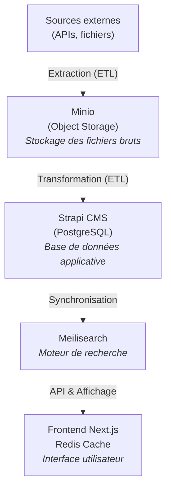
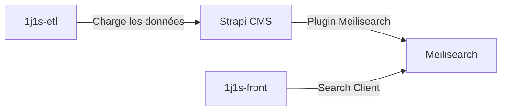

# 1jeune1solution - Documentation Complète

Bienvenue sur le projet **1jeune1solution** ! C'est le service public officiel français destiné aux jeunes de 15-30 ans, hébergé sur 1jeune1solution.gouv.fr.

Ce monorepo contient les trois piliers du projet :

---

## 📋 Vue d'ensemble

Le projet est composé de **3 dépôts distincts** qui travaillent ensemble :

| Projet | Stack | Rôle |
| --- | --- | --- |
| **1j1s-etl** | NestJS, TypeScript | Orchestrateur ETL (flux de données) |
| **1j1s-front** | Next.js, React, TypeScript | Interface utilisateur publique |
| **1j1s-main-cms** | Strapi, TypeScript | CMS headless & back-office |

---

## 🏗️ Architecture détaillée

### 1️⃣ **1j1s-etl** - Backend ETL (NestJS)

**Rôle :** Système d'ingestion et de transformation des données provenant de sources externes.

**Domaines fonctionnels :**

- **Stages** : flux depuis Hellowork, Jobteaser, StageFR
- **Événements** : flux depuis Tous Mobilisés
- **Logements** : flux depuis Immojeune, Studapart
- **Formations initiales** : flux depuis Onisep
- **Gestion des contacts**

**Architecture monorepo NestJS avec CLI :**

```
apps/
  ├── cli/                    # Point d'entrée CLI
  ├── stages/                 # Domaine stages
  ├── evenements/             # Domaine événements
  ├── logements/              # Domaine logements
  ├── formations-initiales/   # Domaine formations
  ├── gestion-des-contacts/   # Domaine contacts
  └── shared/                 # Code partagé

```

Chaque domaine suit le pattern **ETL** :

- **Extraction** : Récupère les données des sources externes
- **Transformation** : Transforme les données au format applicatif
- **Chargement** : Enregistre dans Strapi/Minio

**Mode de fonctionnement (Cron) :**

Contrairement au Front ou au CMS qui sont des services web, l'ETL fonctionne principalement via des tâches planifiées (Cron) sur Scalingo.

- **Récurrence :** Définie dans le fichier `cron.json` (ex: extraction Jobteaser tous les jours à 7h).
- **Exécution manuelle :** Possible en SSH sur Scalingo pour rejouer un flux (`npm run cli -- extract ...`).

**Version :** 4.19.37 | **Node :** 22 | **npm :** 11

---

### 2️⃣ **1j1s-front** - Frontend (Next.js)

**Rôle :** Interface utilisateur publique du site 1jeune1solution.gouv.fr.

**Fonctionnalités principales :**

- Pages publiques (offres, logements, formations, événements)
- Recherche instantanée (Meilisearch)
- Dépose d'offres de stages

**Pour les devs :**

- Tests E2E (Cypress)
- Monitoring (Sentry)

**Stack :**

- Next.js 14 avec App Router
- React 18
- React InstantSearch (Meilisearch)
- Redis pour le cache
- Cypress pour les tests
- Sentry pour le monitoring

**Version :** 3.360.0 | **Node :** 22 | **npm :** 11

---

### 3️⃣ **1j1s-main-cms** - CMS (Strapi)

**Rôle :** Système de gestion de contenu headless pour alimenter le site en données.

**Fonctionnalités :**

- Interface d'administration des contenus
- API REST pour le front
- Synchronisation avec Meilisearch
- Import/export de données
- Gestion des permissions utilisateurs

**Pour les dev :**

- Intégration Sentry

**Plugins Strapi :**

- `config-sync` : Synchronisation des configurations
- `import-export-entries` : Import/export de contenu
- `meilisearch` : Intégration recherche
- `populate-deep` : Population avancée des relations
- `slugify` : Génération automatique des slugs

**Version :** 1.33.13 | **Strapi :** 4.25.23

---

## 🔄 Flux de données



---

## 🛠️ Infrastructure & Services

| Service | Rôle | URL |
| --- | --- | --- |
| **Minio** | Stockage objet (S3-compatible) | Local: `http://localhost:9000` |
| **PostgreSQL** | Base de données Strapi | Local: `postgres://localhost:5432` |
| **Meilisearch** | Moteur de recherche | Local: `http://localhost:7700` |
| **Redis** | Cache frontend | Local: `redis://localhost:6379` |
| **Strapi** | CMS | Local: `http://localhost:1337` |
| **Next.js** | Frontend | Local: `http://localhost:3000` |
| **Sentry** | Monitoring erreurs | Production only |

**Hébergement :** Scalingo (infrastructure cloud)

---

## 🔎 Guide Meilisearch

Meilisearch est le moteur de recherche utilisé par le projet. Voici comment il s'intègre :

### Architecture d'indexation



1. **L'ETL** charge les données brutes dans **Strapi**.
2. **Strapi** synchronise automatiquement ces contenus vers **Meilisearch** via le plugin `strapi-plugin-meilisearch`.
3. **Le Frontend** interroge directement **Meilisearch** via `react-instantsearch` pour l'affichage.

### Configuration

### Côté CMS (1j1s-main-cms)

C'est la source de configuration de l'index.

- **Config plugin** : `config/plugins.ts` et `config/meilisearch/`
- **Ajout de collection** : Créer une config dans `config/meilisearch/[collection]/` et l'importer dans `config/meilisearch/index.ts`.
- **Variables** : `PLUGIN_MEILISEARCH_URL` et `PLUGIN_MEILISEARCH_API_KEY`

### Côté Frontend (1j1s-front)

Le front ne fait que lire.

- **Client** : Initialisé dans `src/client/dependencies.container.ts`
- **Variables** : `NEXT_PUBLIC_STAGE_SEARCH_ENGINE_BASE_URL` et `NEXT_PUBLIC_STAGE_SEARCH_ENGINE_API_KEY`

> Note : L'ETL (1j1s-etl) contient du code legacy pour Meilisearch (MeilisearchIndexingClient) mais ne doit plus être utilisé pour indexer en direct. Tout passe par Strapi.
>

---

## 🚀 Guide de démarrage

### Prérequis

- Node.js 22
- npm 11
- Docker & Docker Compose (recommandé)
- Git

### 1️⃣ ETL (1j1s-etl)

```bash
cd 1j1s-etl

# Installation
npm ci
npm run build

# Lancer un job en local
npm run dev:cli -- extract stages  # Exemple

# Lancer avec Docker
npm run dev:start

```

**Scripts disponibles :**

```bash
npm run build           # Compiler
npm run dev:cli         # CLI développement
npm run cli             # CLI production
npm run test            # Tests unitaires
npm test:integration    # Tests d'intégration
npm test:mutation       # Tests de mutation
npm run lint            # Linter
npm run lint:fix        # Fix automatique

```

---

### 2️⃣ Frontend (1j1s-front)

```bash
cd 1j1s-front

# Setup
npm ci
cp .env.test .env.local

# Démarrer avec Docker Compose
docker compose up

# Visiter
open <http://localhost:3000>

```

**Scripts disponibles :**

```bash
npm run dev             # Développement
npm run build           # Production build
npm start               # Démarrer (après build)
npm run test            # Tests Jest
npm run test:watch      # Tests en mode watch
npm run e2e             # Tests Cypress
npm run lint            # Linter
npm run check-types     # TypeScript check
npm run storybook       # Storybook dev

```

---

### 3️⃣ CMS Strapi (1j1s-main-cms)

```bash
cd 1j1s-main-cms

# Démarrer avec Docker
npm run docker:start

# Visiter l'admin
open <http://localhost:1337/admin>

# Ou en développement sans Docker
npm run dev

```

**Scripts disponibles :**

```bash
npm run docker:start           # Démarrer (avec build)
npm run docker:start::log      # Démarrer avec logs
npm run docker:new-component   # Redémarrer après changement
npm run docker:populate        # Charger les données de recette
npm run docker:down            # Arrêter
npm run docker:clean           # Arrêter et supprimer volumes
npm run develop                # Dev mode sans Docker
npm run build                  # Production build

```

---

## 📚 Documentation

Chaque projet inclut une documentation complète avec **Docusaurus 3** :

### Lancer la documentation

### ETL

```bash
cd 1j1s-etl/docs
npm install
npm start
# → <http://localhost:3000>

```

**Contenu :** Architecture, conventions, ADR, onboarding, tutoriels

### Frontend

```bash
cd 1j1s-front/docs
npm install
npm start
# → <http://localhost:3000>

```

### Déploiement documentations

Les documentations sont **déployées automatiquement** sur GitHub Pages lors d'un merge sur `main` :

- **ETL** : https://dnum-socialgouv.github.io/1j1s-etl/
- **Front** : https://dnum-socialgouv.github.io/1j1s-front/

---

## 🔐 Variables d'environnement

### 1j1s-front

```bash
# .env.local ou .env.test
NEXT_PUBLIC_API_URL=http://localhost:1337/api
NEXT_PUBLIC_MEILISEARCH_URL=http://localhost:7700
NEXT_PUBLIC_MEILISEARCH_KEY=your_key

```

### 1j1s-main-cms

```bash
# .env.docker
DATABASE_HOST=postgres
DATABASE_USERNAME=postgres
DATABASE_PASSWORD=postgres
DATABASE_NAME=strapi_1j1s

MINIO_URL=http://minio:9000
MINIO_ACCESS_KEY=minioadmin
MINIO_SECRET_KEY=minioadmin

```

### 1j1s-etl

```bash
# .env
NODE_ENV=development
MINIO_URL=http://localhost:9000
MINIO_ACCESS_KEY=minioadmin
MINIO_SECRET_KEY=minioadmin

```

---

## 🔗 Liens utiles

### Outils & Monitoring

- Admin Strapi Production
- Sentry - Monitoring
- GitHub - Organisation

### Backlogs

- Backlog technique Frontend
- Backlog fonctionnel

### Dépôts officiels

- 1j1s-etl
- 1j1s-front
- 1j1s-main-cms

---

## 👥 Équipe & Contribution

**Auteur original :** OCTO Technology (avec l'équipe DNUM)

**Pour contribuer :**

- Lire le CONTRIBUTING.md de chaque projet
- Respecter les conventions de code (voir docs/)
- Ouvrir une PR avec description claire

---

## 📝 Architecture Décisions

Les décisions architecturales importantes sont documentées dans les **ADR** (Architecture Decision Records) :

```bash
# Dans 1j1s-etl/docs/adr/
ls adr/

```

---

## 👷 Déploiement et Environnements

Le workflow de déploiement est identique pour les 3 projets (`front`, `etl`, `cms`) et repose sur une séparation stricte entre la **Recette** (automatique) et la **Production** (manuelle).

### 1. Environnement de Recette (Staging)

L'environnement de recette reflète l'état de la branche `main` en quasi temps réel.

- **URL** : recette.1jeune1solution.gouv.fr
- **Déclenchement** : Automatique à chaque `push` ou `merge` sur la branche `main`.
- **Mécanisme** :
    1. **Infrastructure** : Github Actions applique les changements Terraform/OpenTofu automatiquement (`terraform-recette.yml`).
    2. **Application** : L'intégration native Scalingo détecte le commit sur `main` et déploie le code.
- **Validation** : C'est ici que les tests d'intégration et la validation fonctionnelle doivent être effectués.

### 2. Environnement de Production

Le déploiement en production est un acte volontaire et manuel.

- **URL** : www.1jeune1solution.gouv.fr
- **Déclenchement** : Manuel via le workflow GitHub Actions **"Mise en production"**.
- **Mécanisme** :
    1. **Infrastructure** : Le workflow exécute `terraform apply` sur l'environnement de production.
    2. **Application** : Il demande ensuite à Scalingo de déployer la version courante de `main`.

### 3. Gestion des Releases (Release Please)

Nous utilisons `release-please` pour gérer les versions et le changelog.

- Lorsqu'une PR de release est créée automatiquement (ex: `chore(main): release 1.0.0`), un workflow spécifique (`terraform-pr`) se déclenche.
- Ce workflow exécute un `terraform plan` sur la **Production** (au lieu de la Recette) pour permettre de valider l'impact sur l'infrastructure de production avant le merge.
- Une fois cette PR de release mergée sur `main`, le code est prêt. Vous devez alors lancer la mise en production manuelle pour l'appliquer.

---

## 🐛 Signaler un bug ou proposer une fonctionnalité

- **Bugs** : GitHub Issues
- **Fonctionnalités** : GitHub Discussions ou Jira pour le backlog fonctionnel

---

## 📄 License

MIT - Voir les fichiers LICENSE individuels

---

**Dernière mise à jour :** 20 janvier 2026
