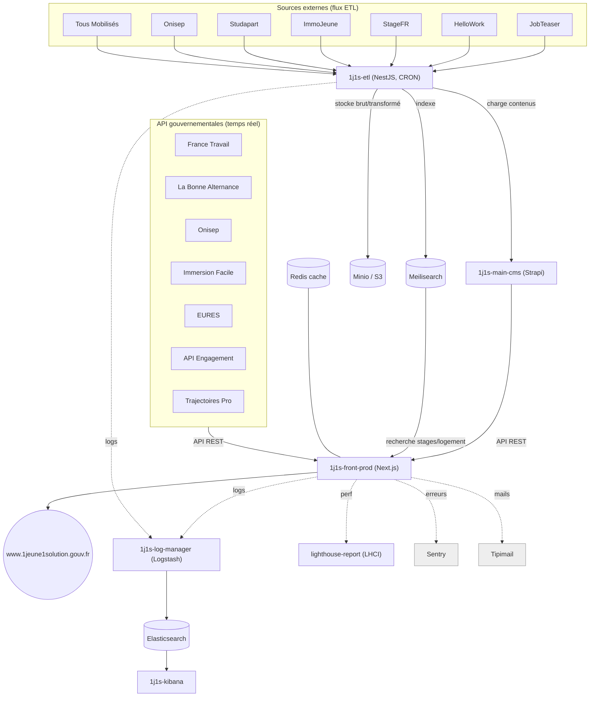

# Cartographie & audit de l'écosystème 1jeune1solution (1j1s)

> Périmètre : organisation GitHub **`DNUM-SocialGouv`** + compte **Scalingo** (région `osc-fr1`).
> Date : 2026-06-26 · Auteur : audit automatisé (sources tracées en annexe).
> Chaque affirmation porte un **niveau de fiabilité** et un **lien vers sa source** ([S…](#annexe-sources)).

## Échelle de fiabilité

| Symbole | Sens | Base |
|---|---|---|
| ✅ | Confirmé (API Scalingo) | Réponse directe de l'API Scalingo, rejouable |
| 🟢 | Confirmé (code + CI) | Fichier présent dans le repo cloné (Terraform, workflow, `package.json`…) |
| 🟡 | Inféré (cohérent multi-sources) | Déduction recoupée par ≥2 indices concordants |
| 🔴 | Incertain / à vérifier | Manque d'accès (Scalingo) ou source unique non corroborée |

> ⚠️ **Limite majeure de fiabilité** : la clé API Scalingo fournie ne voit aujourd'hui **qu'une seule app** (`1j1s-front-prod`) [S1](#s1). Tout le reste de la cartographie « déployé » est donc **inféré du code/CI (🟢/🟡)**, pas confirmé en direct sur Scalingo. Les droits sur les autres projets Scalingo sont *en cours d'ouverture* : cette section sera **rafraîchie** dès l'accès étendu.

---

## 1. Résumé exécutif (TL;DR)

- **1 produit en prod** : le site `www.1jeune1solution.gouv.fr`, servi par l'app Scalingo **`1j1s-front-prod`** (Next.js) ✅ [S1](#s1).
- **Stack vivante (5 composants)** : `1j1s-front` (Next.js) · `1j1s-main-cms` (Strapi, CMS principal) · `1j1s-etl` (NestJS, ingestion de flux) · `1j1s-logstash` + `1j1s-kibana` (observabilité ELK). Tous déployés via **Terraform/OpenTofu → Scalingo** 🟢 [S6](#s6).
- **1 utilitaire actif** : `1j1s-front-lighthouse-report` (serveur LHCI de suivi perf) 🟢 [S15](#s15).
- **Données** : l'ETL ingère ~8 flux externes (stages, logement, événements, formations) et les pousse vers **Strapi + Meilisearch + Minio/S3** 🟢 [S9](#s9). Le front agrège en plus **~12 API gouvernementales** (France Travail, La Bonne Alternance, Onisep, Immersion Facile, EURES, API Engagement…) 🟢 [S4](#s4).
- **À décommissionner (≈11 repos morts)** : toute l'ancienne chaîne « stages » (5 repos 2022-2023), l'ancien CMS `1j1s-cms`, l'`1j1s-api` (déjà marqué « inutile »), le PoC nginx, les tests de charge 2022, la collection Postman, et le socle bash `1j1s-infrastructure` (remplacé par Terraform). Détail en [§6](#6-maintenance--décommissionnement).
- **Angles morts / risques** : hébergement de **Meilisearch** et **Minio** non décrit dans l'IaC clonée 🔴 [S5](#s5) ; statut *live* réel des apps hors-front non confirmable sans accès Scalingo 🔴 [S1](#s1).

---

## 2. Méthode & sources

1. **Clone** des 18 repos `1j1s-*` pertinents dans `.repos/` (gitignoré) [S2](#s2).
2. **Introspection Scalingo** read-only via l'API (`auth.scalingo.com` → `api.osc-fr1.scalingo.com`) : app, addons, domaines, formation, SCM link, collaborateurs, déploiements [S1](#s1). **Valeurs des variables d'env volontairement non collectées** (seuls les *noms*) — aucune exfiltration de secret/donnée.
3. **Analyse statique** de chaque repo : `package.json`, `terraform/*.tf`, `.github/workflows/*.yml`, `Procfile`, `cron.json`, README [S3](#s3)–[S17](#s17).
4. **Recoupement** GitHub (statut archivé, dates) ↔ Terraform ↔ API Scalingo.

---

## 3. Inventaire des 18 repos

Statut GitHub (archivé/actif) et dernière activité confirmés [S3](#s3).

| Repo | Visib. | Dernier commit | Rôle | Classe | Fiab. |
|---|---|---|---|---|---|
| **1j1s-front** | public | 2026-06-19 | Front Next.js (le site) | 🟩 Actif/prod | ✅ [S1](#s1) |
| **1j1s-main-cms** | public | 2025-10-01 | CMS Strapi principal | 🟩 Actif/prod | 🟢 [S7](#s7) |
| **1j1s-etl** | public | 2025-05-02 | Ingestion de flux (NestJS) | 🟩 Actif/prod | 🟢 [S9](#s9) |
| **1j1s-logstash** | privé | 2025-03-12 | ELK – agrégation de logs | 🟩 Actif/prod | 🟢 [S12](#s12) |
| **1j1s-kibana** | privé | 2025-02-19 | ELK – visualisation logs | 🟩 Actif/prod | 🟢 [S13](#s13) |
| **1j1s-front-lighthouse-report** | public | 2025-08-15 | Serveur LHCI (perf front) | 🟦 Utilitaire actif | 🟢 [S15](#s15) |
| **1J1S** | privé | 2023-02-07 | Méta-repo (submodules) | ⬜ Doc/orphelin | 🟢 [S14](#s14) |
| **1j1s-cms** | public | 2023-01-10 | Ancien CMS Strapi 4.5 | 🟥 Déprécié | 🟢 [S8](#s8) |
| **1j1s-infrastructure** | privé | 2024-07-01 | Scripts bash déploiement (pré-TF) | 🟥 Déprécié | 🟢 [S11](#s11) |
| **1j1s-stage-content-manager** | privé | 2023-01-24 | CMS Strapi des stages (legacy) | 🟥 Décommission | 🟢 [S10](#s10) |
| **1j1s-datasource-request-collection** | privé | 2022-10-27 | Collection Postman/API | 🟥 Décommission | 🟢 [S9](#s9) |
| **1j1s-test-charge** | privé | 2022-10-05 | Tests de charge k6 | 🟥 Décommission | 🟢 [S16](#s16) |
| **1j1s-api** | public · *archivé* | 2022-07-08 | API contacts (PoC InMemory) | 🟥 Décommission | 🟢 [S10](#s10) |
| **1j1s-orchestrateur-stages** | privé · *archivé* | 2022-07-04 | Orchestrateur stages (legacy) | 🟥 Décommission | 🟢 [S10](#s10) |
| **1j1s-stage-orchestrateur-extract** | privé · *archivé* | 2022-08-29 | Extraction stages (legacy) | 🟥 Décommission | 🟢 [S10](#s10) |
| **1j1s-stage-indexeur** | privé · *archivé* | 2022-06-29 | Indexeur stages (jamais fini) | 🟥 Décommission | 🟢 [S10](#s10) |
| **1j1s-logement-ETL** | privé · *archivé* | *(vide)* | ETL logement (vide, migré) | 🟥 Décommission | 🟢 [S9](#s9) |
| **scalingo-nginx-poc** | privé · *archivé* | 2022-10-10 | PoC reverse-proxy nginx | 🟥 Décommission | 🟢 [S17](#s17) |

Légende classes : 🟩 Actif & utilisé · 🟦 Utilitaire actif · ⬜ Documentation/orphelin · 🟥 Déprécié/à décommissionner.

---

## 4. Cartographie des déploiements Scalingo

> ✅ = confirmé live par l'API ; 🟢 = config lue dans le Terraform du repo ; 🟡 = nom d'app prod **inféré** (paramétré via secret GitHub `TF_VAR_NOM_DE_L_APPLICATION`, non visible dans le code).

| App Scalingo | Repo source | Runtime | Formation (prod) | Addon | Mise en veille | Déploiement | Fiab. |
|---|---|---|---|---|---|---|---|
| **`1j1s-front-prod`** | 1j1s-front | Next.js | 2× **XL** web (autoscale 2→10) | **Redis** `redis-business-256` | non (24/7) | manuel (`mise-en-production.yml`) depuis `main`, auto-deploy **OFF** | ✅ [S1](#s1) / 🟢 [S6](#s6) |
| `1j1s-front-recette` 🟡 | 1j1s-front | Next.js | 1× M | Redis `redis-starter-256` | — | auto sur push `main` | 🟢 [S6](#s6) |
| `1j1s-main-cms-prod` 🟡 | 1j1s-main-cms | Strapi 4.25 | 2× L (autoscale 2→4) | **PostgreSQL** `postgresql-business-1024` | **oui** (20h→4h UTC) | manuel + TF | 🟢 [S7](#s7) |
| `1j1s-log-manager` 🟡 | 1j1s-logstash | Logstash | 1× L | **Elasticsearch** `elasticsearch-business-1024` (1 Go) | — | TF apply | 🟢 [S12](#s12) |
| `1j1s-kibana` 🟡 | 1j1s-kibana | Kibana (stack `scalingo-22`) | 1× M | (partage l'ES du log-manager) | — | TF apply (`terraform-mep.yml`) | 🟢 [S13](#s13) |
| `1j1s-etl` 🟡 | 1j1s-etl | NestJS CLI | **0 web** (jobs CRON only) | Minio/S3 + Meilisearch (via env, hors TF 🔴) | — (jobs planifiés) | manuel + TF | 🟢 [S9](#s9) |
| `1j1s-front-lighthouse-report` 🟡 | …lighthouse-report | LHCI server | 1× L | **PostgreSQL** `postgresql-starter-512` | **oui** (19h→6h, lun-ven) | TF apply | 🟢 [S15](#s15) |

Outillage Terraform commun : provider **Scalingo**, **Cloudflare** (DNS), **StatusCake** (uptime), backend d'état **S3/Minio** [S6](#s6).

**Drain de logs** : `1j1s-front` et `1j1s-etl` envoient leurs logs vers le `log-manager` (Logstash) via `log_drains` 🟢 [S12](#s12) → indexés dans Elasticsearch → consultés via Kibana.

---

## 5. Architecture & flux de données

Points notables :
- **Deux moteurs de recherche distincts à ne pas confondre** : **Meilisearch** = moteur *applicatif* (recherche stages/logement côté front, `@meilisearch/instant-meilisearch`) 🟢 [S5](#s5) ; **Elasticsearch** (addon 1 Go) = uniquement le *stockage de logs* ELK 🟢 [S12](#s12).
- Le front **ne se connecte directement à aucune base** : il passe par Strapi (contenu), Meilisearch (recherche), Redis (cache), et les API externes 🟢 [S4](#s4).
- Services SaaS externes consommés par le front : **Sentry** (erreurs/APM), **Matomo** (analytics), **Tipimail** (emails), **Cloudflare** (DNS/WAF), **StatusCake** (uptime) 🟢 [S4](#s4).

---

## 6. Maintenance & décommissionnement

### 6.1 Candidats à la décommission (≈11 repos morts)

Aucun n'a d'activité depuis ≥ 2 ans et tous sont remplacés ou inutilisés 🟢 [S10](#s10) [S8](#s8) [S11](#s11) [S16](#s16) [S17](#s17) :

| Repo | Pourquoi mort | Remplacé par | Pré-requis avant suppression |
|---|---|---|---|
| `1j1s-stage-content-manager` | CMS stages legacy (2023) | `1j1s-main-cms` + `1j1s-etl` | Vérifier qu'aucune app Scalingo `…stages-cms` ne tourne encore 🔴 |
| `1j1s-orchestrateur-stages` | pipeline stages legacy (« wip » 2022) | `1j1s-etl/apps/stages` | — (archivé) |
| `1j1s-stage-orchestrateur-extract` | extraction stages legacy | `1j1s-etl/apps/stages/extraction` | — (archivé) |
| `1j1s-stage-indexeur` | jamais implémenté (README seul) | `1j1s-etl/apps/stages/chargement` | — (archivé) |
| `1j1s-logement-ETL` | **dépôt vide** (0 commit) | `1j1s-etl/apps/logements` | — (archivé) |
| `1j1s-api` | PoC InMemory « finalement inutile » | `1j1s-etl/apps/gestion-des-contacts` | — (déjà archivé) |
| `1j1s-cms` | ancien Strapi 4.5 / Node 16 (2022) | `1j1s-main-cms` | **Migrer/archiver les données** si encore utiles ; couper l'éventuelle app Scalingo `1j1s-cms` 🔴 |
| `scalingo-nginx-poc` | PoC reverse-proxy abandonné | (front exposé direct, `force_https`) | — (archivé) |
| `1j1s-test-charge` | k6, dernier run oct. 2022 | — (à refaire si besoin) | Récupérer les scénarios k6 réutilisables avant suppression |
| `1j1s-datasource-request-collection` | collection Postman 2022 | tests d'intégration de `1j1s-etl` | — |
| `1j1s-infrastructure` | scripts bash pré-Terraform (2024) | Terraform dans chaque repo | Vérifier qu'aucune procédure de prod ne le référence encore |
| `1J1S` (méta-repo) | submodules, README vide | — | **Optionnel** : garder comme index, ou supprimer |

> Recommandation : pour les repos GitHub déjà *archivés*, la suppression est sûre. Pour les non-archivés morts (`1j1s-cms`, `1j1s-infrastructure`, `1j1s-test-charge`, `1j1s-datasource-request-collection`, `1j1s-stage-content-manager`), **archiver d'abord** (révèle les usages cachés sans rien casser), supprimer plus tard.

### 6.2 Prochaines actions de maintenance

1. **Étendre l'accès Scalingo** (en cours) puis rejouer l'introspection : confirmer la liste *réelle* des apps live, repérer les apps **fantômes encore facturées** (ancien `1j1s-cms`, `…stages-cms`, environnements de recette oubliés). 🔴 → ✅ [S1](#s1)
2. **Documenter l'hébergement de Meilisearch et Minio/S3** : absents de l'IaC clonée alors qu'ils sont critiques (recherche front + stockage ETL). Risque de composant non géré en IaC 🔴 [S5](#s5).
3. **Surveiller les déploiements front** : auto-deploy **OFF** et un `build-error` a précédé le dernier déploiement réussi (2026-06-19) ✅ [S1](#s1) → la prod ne se met à jour que sur action manuelle, à garder en tête.
4. **Cohérence des runtimes Node** : front sur Node 22 🟢, `main-cms` sur Node 18 🟢, ancien `1j1s-cms` sur Node 16 (obsolète) 🟢 [S8](#s8) — un argument de plus pour retirer l'ancien CMS.
5. **Coûts** : revoir le dimensionnement ELK (Elasticsearch 1 Go) et la mise en veille — la prod front (2× XL) tourne 24/7 (normal), mais recette/CMS/lighthouse sont déjà mis en veille la nuit 🟢 [S7](#s7) [S15](#s15) ; vérifier que tous les environnements non-prod le sont.
6. **Hygiène GitHub** : exécuter les archivages/suppressions du §6.1 pour réduire la surface (152 repos dans l'org, dont 17 `1j1s-*`).

---

## 7. Annexe — sources & inférences {#annexe-sources}

> Chaque entrée précise *comment* l'information a été obtenue. Les chemins repos sont sous `.repos/`.

**[S1] API Scalingo — app `1j1s-front-prod`.** `GET https://api.osc-fr1.scalingo.com/v1/apps` et endpoints associés (`/addons`, `/domains`, `/scm_repo_link`, `/containers`, `/collaborators`, `/deployments`), token obtenu par échange sur `auth.scalingo.com`. Résultats : 1 seule app visible ; `running` ; 2× conteneurs `web` taille XL ; addon `Redis redis-business-256` ; domaines `www.1jeune1solution.gouv.fr` (canonique) + apex ; SCM link → `DNUM-SocialGouv/1j1s-front` branche `main`, `auto_deploy=false` ; owner `1j1s` ; 5 collaborateurs ; dernier déploiement `2026-06-19` (précédé d'un `build-error`). `osc-secnum-fr1` : 0 app. → **fiabilité ✅, mais visibilité limitée à cette app.**

**[S2] Clones GitHub.** `git clone --depth=1 https://github.com/DNUM-SocialGouv/<repo>` des 18 repos dans `.repos/`. L'org cible est **`DNUM-SocialGouv`** (et non `SocialGouv`, qui ne contient que `carte-jeune-engage`, archivé) — vérifié via `gh search repos`.

**[S3] Métadonnées GitHub.** `gh repo list DNUM-SocialGouv --json name,isArchived,visibility,pushedAt,description` + `git -C <repo> log -1`. Donne visibilité, statut archivé et date du dernier commit de chaque repo.

**[S4] Dépendances du front.** `1j1s-front/src/server/services/serverConfiguration.service.ts` (≈l.6-56) : déclaration des clients HTTP vers France Travail, La Bonne Alternance, Onisep, Immersion Facile, EURES, API Engagement, Trajectoires Pro, API Adresse/GEO, Strapi, Tipimail. `1j1s-front/package.json` : `next@14.2.35`, `@sentry/nextjs`, `ioredis`, `@meilisearch/instant-meilisearch`. `next.config.js` : `STRAPI_MEDIA_URL`, hosts images.

**[S5] Meilisearch (moteur de recherche front).** `1j1s-front/src/client/dependencies.container.ts:1,142-148` : `instantMeiliSearch(...)` lit `NEXT_PUBLIC_STAGE_SEARCH_ENGINE_BASE_URL` / `…_API_KEY`. Composants UI sous `1j1s-front/src/client/components/ui/Meilisearch/`. **Aucun addon/app Meilisearch trouvé dans les `*.tf`** des repos clonés (grep `meilisearch` sur `1j1s-main-cms`, `1j1s-etl`, `1j1s-front` → 0 résultat IaC) → hébergement **non documenté dans l'IaC clonée** 🔴.

**[S6] Déploiement front (Terraform/CI).** `1j1s-front/terraform/front.tf` (name=`var.nom_de_l_application`, l.7 ; Redis l.40-41 ; domaines l.45-46 ; auto-deploy off l.25-32) ; `terraform/versions.tf` (providers Scalingo/Cloudflare/StatusCake, backend S3) ; `.github/workflows/mise-en-production.yml` (workflow_dispatch, `scalingo integration-link-manual-deploy main`), `terraform-recette.yml` (auto sur push main). Noms d'app prod/recette = secrets GitHub ⇒ exacts **inférés** 🟡.

**[S7] `1j1s-main-cms` (CMS principal).** `package.json:5,28` (Strapi `4.25.23`, « cms principal d'1Jeune1Solution, version typescript ») ; `terraform/app.tf:7,33` (PostgreSQL `postgresql-business-1024` en prod, conteneurs L, autoscale 2→4) ; `.github/workflows/mise-en-veille.yml:5-6` (scale-to-0 20h→4h UTC) ; `docs/.../tutoMeP.md` (3 projets de prod : front, etl, main-cms). Nom app prod `1j1s-main-cms-prod` cité dans `docs/proc/indexation-depuis-un-poste-local.md` 🟡.

**[S8] `1j1s-cms` (ancien CMS).** `package.json:24,33-35` (Strapi `4.5.1`, Node 16/npm 8) ; un seul commit visible daté 2022-12-26 ; pas de `*.tf` ni de workflow de déploiement (uniquement `release-please.yml`). → déprécié, remplacé par `1j1s-main-cms`.

**[S9] `1j1s-etl` + repos data.** `1j1s-etl/README.md`, structure `apps/{stages,logements,evenements,formations-initiales,gestion-des-contacts,maintenance,shared,cli}` ; `cron.json` (≈20 jobs : jobteaser 7h, hellowork 4h30, stagefr 6h, immojeune/studapart 5h, onisep mensuel) ; gateways Strapi (`apps/stages/src/chargement/...`) et Meilisearch (`apps/shared/.../meilisearch-indexing.client.ts`) ; `terraform/app.tf:7` (web amount 0 = CRON only). `1j1s-logement-ETL` : `git log` → « aucun commit » (vide). `1j1s-datasource-request-collection` : collection Postman (1 commit 2022-10).

**[S10] Chaîne « stages » legacy + `1j1s-api`.** `1j1s-orchestrateur-stages/doc/1-presentation.md` (pipeline extraction/indexation), `Procfile` (crons Scalingo) ; `1j1s-stage-indexeur` = `LICENSE`+`README.md` seuls (vérifié `ls -AR`) ; `1j1s-api/src/bin/...` `InMemoryDemandeDeContactRepository` (non persistant) ; `1j1s-etl/CHANGELOG.md` mentionne l'ancien nom `1j1s-stage-orchestrateur-transform-load` (renommage 2023-01) ⇒ migration vers l'ETL unifié.

**[S11] `1j1s-infrastructure` (socle bash pré-TF).** `apps/main.sh` (menu Front/CMS/CMS Stages/ETL/Main CMS), `apps/front/main.sh`, `apps/cms/main.sh`, `documentation/*.md` : déploiement via **Scalingo CLI**, pas de Terraform. Dernier commit 2024-07. Remplacé par le Terraform embarqué dans chaque repo applicatif.

**[S12] `1j1s-logstash` (ELK).** `terraform/log-manager.tf:5,12-31` (app, conteneur L, addon `elasticsearch-business-1024`) ; `Procfile:1` (`bin/logstash -f logstash.conf`) ; `cron.json` (curator) ; `.github/workflows/terraform-apply.yml`. Drains entrants confirmés côté `1j1s-front/terraform/front.tf:49-54` et `1j1s-etl/terraform/app.tf:27-32` (`log_drains[elk]`).

**[S13] `1j1s-kibana`.** `terraform/kibana.tf:6,8,12-30` (conteneur M, stack `scalingo-22`, connexion à l'Elasticsearch du log-manager) ; `Procfile:1` (`kibana --port $PORT`) ; `.github/workflows/terraform-mep.yml`. Dernier commit 2025-02 (upgrade stack).

**[S14] `1J1S` (méta-repo).** `.gitmodules` : submodules `cms → 1j1s-main-cms`, `front → 1j1s-front`, `etl → 1j1s-etl` (vérifié). README quasi vide, 1 commit (2023-02). Confirme que **`1j1s-main-cms` est LE cms** de référence (et non `1j1s-cms`).

**[S15] `1j1s-front-lighthouse-report`.** `terraform/lighthouse-server.tf:7,29` (app Scalingo, PostgreSQL `postgresql-starter-512`) ; `server.js` (LHCI `@lhci/server`, rétention 60 j) ; workflows `terraform-apply.yml`, `mise-en-veille.yml`/`sortie-de-veille.yml` (veille 19h→6h lun-ven) ; dernier commit 2025-08 (Dependabot).

**[S16] `1j1s-test-charge`.** `src/test_de_charge.js`, `src/config.js:13-28` (k6, cibles `1j1s-front.osc-fr1.scalingo.io` et `…-prod…`) ; rapports `reporting/PROD/` datés 2022-10 ; 1 commit « wip ». Outil ad-hoc jamais industrialisé.

**[S17] `scalingo-nginx-poc`.** `README.md:2` (« PoC … serveur nginx en frontal 1j1s ») ; `nginx.conf.erb:1-3` (`proxy_pass` vers `ENV["URL_FRONT"]`) ; pas de `Procfile`/build ⇒ jamais déployé. Abandonné : le front est exposé directement (`force_https`, domaines Scalingo) — cf. [S6](#s6).

---

### Reproductibilité

- Introspection Scalingo : `source .secrets/.env` puis échange de token sur `auth.scalingo.com` → appels `GET` sur `api.osc-fr1.scalingo.com` (valeurs d'env **non lues**).
- Clones : présents sous `.repos/` (gitignoré). Re-cloner via `gh`/`git clone --depth=1`.
- **À rafraîchir** dès l'ouverture des droits Scalingo : la table du [§4](#4-cartographie-des-déploiements-scalingo) (passer les 🟡/🔴 en ✅) et la liste des apps fantômes facturées ([§6.2](#62-prochaines-actions-de-maintenance) pt.1).
