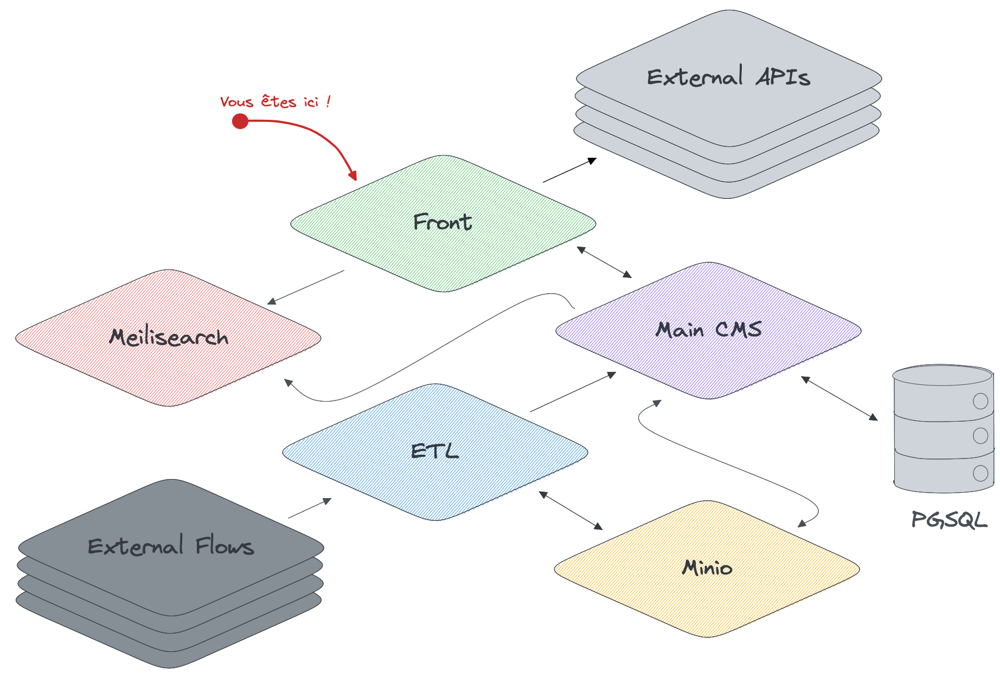

# Big Picture du produit

## Architecture globale simplifiée

## Architecture de ce dépôt

Notre application est découpée de la sorte :

- Une partie `client` générée de deux manières différentes :
  - Des pages générées statiquement lors de l'étape de `build` de l'application ;
  - Des pages générées dynamiquement par des composants lorsqu'un utilisateur accède à une ressource.
- Une partie `server` qui nous sert d'interfaces avec les services externes consommés, basé sur un processus Node.js.

## Liste des fonctionnalités

- [x] Chercher une offre d'emploi
- [x] Chercher une offre d'alternance
- [x] Chercher une offre de stage
- [ ] Chercher un logement étudiant
- [x] Rechercher un service civique
- [x] Rechercher une activité de bénévolat
- [x] Consulter les mesures jeunes
- [x] Consulter les mesures entreprises
- [x] Consulter les mesures entreprises
- [ ] Déposer une offre de stage
- [x] Déposer une offre d'alternance
- [x] Découvrir le contrat d'engagement jeune
