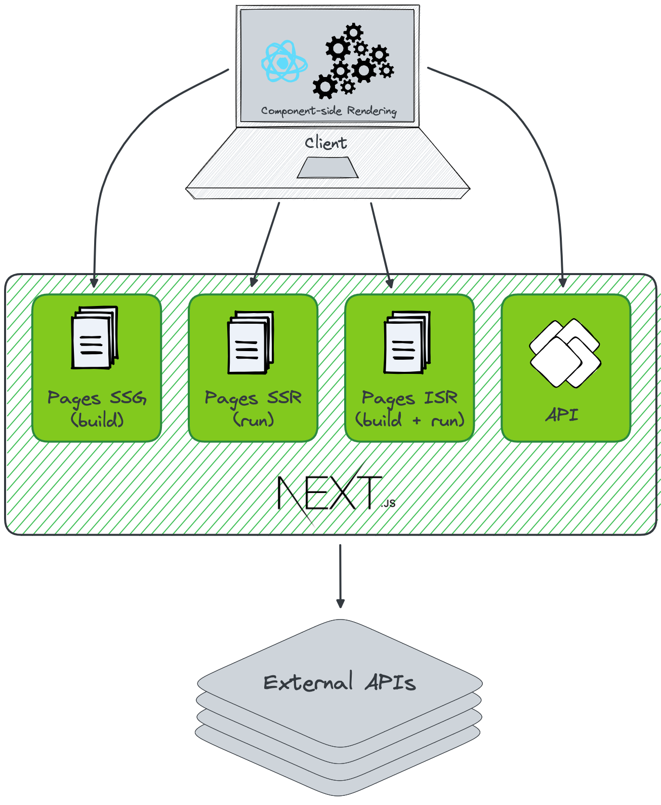

# Architecture de 1j1s-front

## Introduction

Propulsé par NextJS, l'application est découpée de la sorte :
- Une partie `client` qui présente ce qui est affiché à nos utilisateurs
- Une partie `server` qui nous sert d'interfaces avec [les services externes consommés](./ecosysteme#services-externes)


## Technologies

* Langage : TypeScript
* Framework : NextJS
* Environnement serveur : NodeJS
* Tests : Jest + React Testing library + Cypress
* Style : CSS Modules + Sass
* Package Manager : npm


## ADR (Architectural Decision Record)

Certains choix techniques sont expliqués [l'ADR](../ADR).


## Génération des pages web



L'application exploite les possibilités de NextJS pour optimiser les performances lors de la génération des pages web :
- Des pages statiques (SSG), générées lors de l'étape de `build` de l'application pour quelques "pages de base" (accueil, pages de recherche, etc.)
- Des pages statiques créées à la demande et mises à jour périodiquement (ISR) pour les pages se basant sur un service externe présentant des données froides (description d'offre, lien avec le CMS, etc.)
- Des pages générées dynamiquement (SSR) quand celles-ci présentent des données chaudes (pas de page répondant à ce critère)

Les pages de recherche sont mise à jour côté client (CSR) grâce à des requêtes HTTP entre le client et le BFF (back-for-front).


## Structure

Le code source est découpé en 4 parties :
```
src
├─── client
├─── pages
├─── server
└─── styles
```

### Client

Comprend tout fichier utile à l'affichage et la logique côté client.

```
client/
└─── components/
     ├── features/ : composants avec logique métier
     ├── head/ : composants pour mettre à jour les données dans la balise `head`
     ├── layouts/ : composants mutualisé pour la mise en page
     └── ui/ : composants génériques en lien avec la charte graphique
```


### Pages

Point d'entrée des pages et chemins d'accès du site.

```
└─── pages/
     ├── {ma-page}/
     │    ├── index.analytics.ts : données d'analytics à transmettre lors de l'interaction avec la page
     │    ├── index.page.tsx : point d'entrée de la page
     │    └── index.page.test.tsx : fichier de test de la page, avec React Testing Library
     ├── ...
     └── api/ : ensemble des resources exposés
          ├── middlewares : middlewares partagés dans les ressources exposées
          └── {resource}/ : resource exposée
                ├── index.controller.ts : point d'entrée de l'endpoint
                └── index.controller.test.ts : fichier de test de la resource
```

### Server

Logique métier et interaction avec les services externes. Structure tendant vers la clean architecture.
Le nom des dossiers est au pluriel alors que le nom des fichiers est au singulier.

```
└─── server/
     ├── {modules}/
     │    ├── configuration/ : centralisation des dépendances pour le module et configuration éventuelle pour les clients http 
     │    ├── domain/ : types liés au module et interface du repository
     │    ├── infra/
     │    │     └── repositories/ : implémentation de l'interface du domain et typage des objets liés aux repositories
     │    └── useCases/ : cas d'usage métier
     └── ...
```

Le dossier `configuration/` à la racine de `server/` et de chaque module s'occupe d'initialiser, à l'aide d'une seule fonction, toutes les dépendances dans son scope respectif.


### Styles

Fichiers de styles partagés, ni lié à un seul composant ni à un layout ou page. Afin d'exploiter certaines facultés de Sass, les fichiers sont découpés comme suit dans les différents dossiers, le cas échéant :
* `_mixins.scss` : mixin Sass
* `_placeholders` : placeholders Sass
* `_styles` : style
* `_variables` : variables Sass
Tous les fichiers utiles pour composer le style côté client, répartis dans les différents sous-dossiers de `styles/`, sont importés depuis le fichier `_utilities/` à la racine de `styles/`, pour que seul ce fichier soit ensuite importé.   

```
└─── styles
     ├── components/ : styles partagés liés à des composants
     ├── media/ : tout ce qui est en rapport aux règles @media
     ├── reset/ : style pour reset le CSS des agents utilisateurs
     ├── theme/ : transposition du theme
     ├── typographie/ : tout ce qui concerne le texte
     ├── _utilities.scss : fichier important tout ce qui est utile pour la coposition du style de l'application
     └── main.css : règles de base communes à tout le site
```


## Nomenclature des fichiers

Les fichiers sont découpés selon leur destination et suffixés en conséquence :
* `*.test.tsx` : test d'un composant reprenant le même nom. Ex : `Modal.tsx` et `Modal.test.tsx`.
* `*.test.ts` : test d'un fichier TypeScript reprenant le même nom. Ex : `analytics.service.ts` et `analytics.service.test.ts`. 
* `*.mock.ts` : fonctions utilitaires pour stub / mock des services, fonctions, etc.
* `*.fixture.ts` : données de test.
* `*.module.scss` : style Sass, lié à un composant. Ex : `Modal.tsx` et `Modal.module.scss`.
* `*.page.tsx` : point d'entrée et composant d'une page générée par NextJS. Le suffixe est important selon la configuration de l'application NextJS.
* `*.analytics.ts` : configuration des données d'analytics liées à la page.
* `*.controller.ts` : point d'entrée d'une ressource exposée par le BFF. Le suffixe est important selon la configuration de l'application NextJS.
* `*.middleware.ts` : middleware utilisé dans un ou plusieurs contrôleurs.
* `*.util.ts` : fonctions utilitaires nécessaires dans le module courant.
* `*.repository.ts` : dans un domaine, interface d'un repository. Côté infra, implémentation de l'interface.
* `*.mapper`
* 
