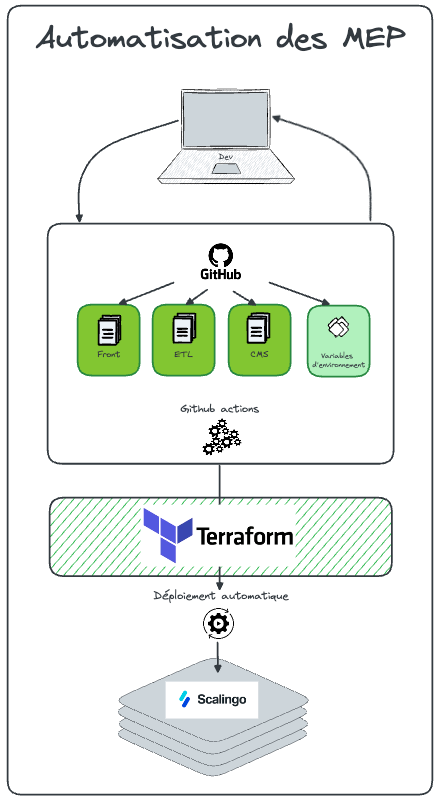
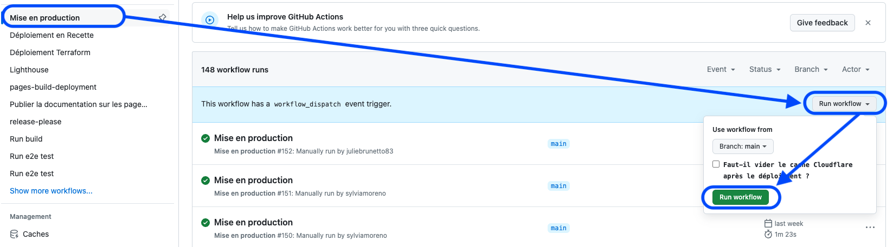

# Comment mettre en production ?

  

_12 Juillet 2024_

Terraform est un outil d'Infrastructure as Code (IaC) développé par HashiCorp qui permet de définir, provisionner et gérer des infrastructures de manière déclarative. Associé aux github actions, il nous permet de pousser automatiquement du code en Production. 

## Fonctionnement

En définissant l'infrastructure comme du code, il permet une gestion plus efficace, traçable et reproductible des environnements de production, tout en s'intégrant parfaitement dans les pipelines CI/CD pour un déploiement continu et fiable.

Les avantages sont multiples : 
* **Traçabilité** : Chaque modification de l'infrastructure est versionnée et traçable via des systèmes de gestion de code source comme Git.
- **Reproductibilité** : Les mêmes configurations peuvent être utilisées pour déployer des environnements identiques, facilitant les tests et la production.
- **Multi-cloud** : Terraform supporte plusieurs fournisseurs de cloud (AWS, Azure, GCP, etc.), permettant une gestion cohérente des infrastructures sur différentes plateformes.
- **Déclaratif** : La nature déclarative de Terraform simplifie la gestion des infrastructures complexes en se concentrant sur l'état final souhaité plutôt que sur les étapes nécessaires pour y parvenir.

## Mise en oeuvre via Github

Les actions ci-dessous sont à réaliser pour chaque projet présent sur Github : 
* 1j1s-front
* 1j1s-etl
* 1j1s-main-cms

* Sélectionner le projet à publier
* Sélectionner "Actions"
* Sélectionner "Mise en production"
* Sélectionner "Run workflow"
* Valider le lancement de la mise en production via le CTA "Run workflow"

* Envoyer un message sur le MM "MEP" indiquant qu'une mise en production est en cours
* S'assurer qu'aucune erreur n'est remontée 
* Mettre à jour le message sur le MM "MEP" afin d'indiquer que la mise en production est terminée
